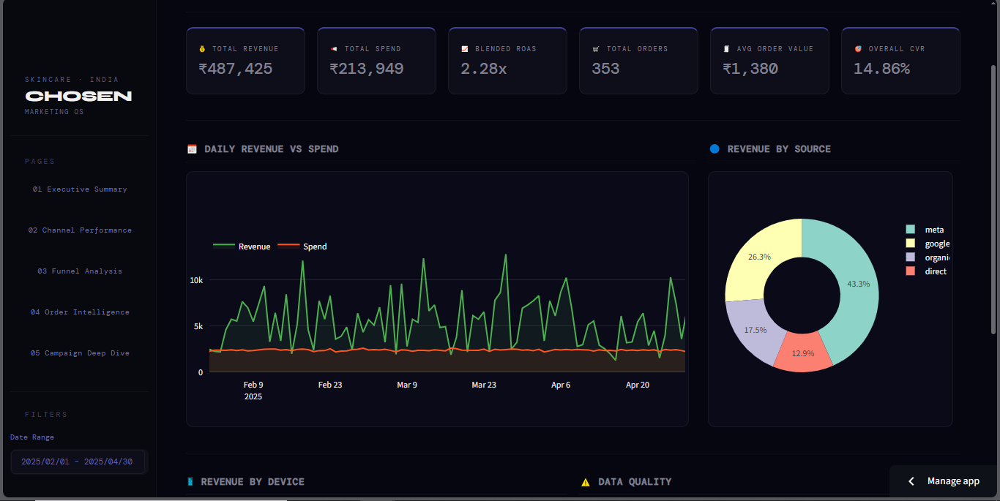
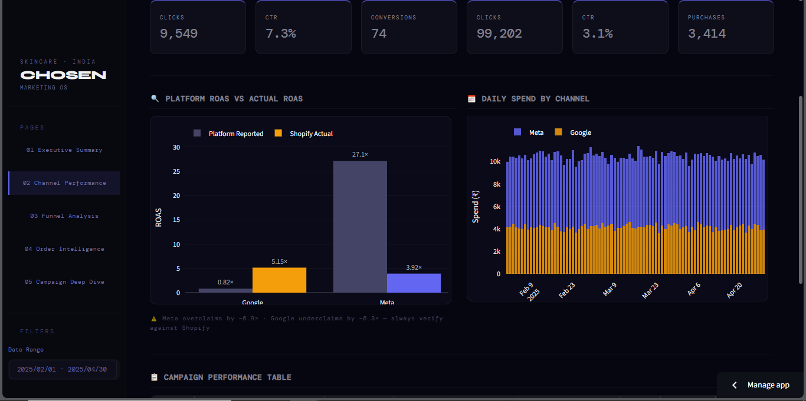
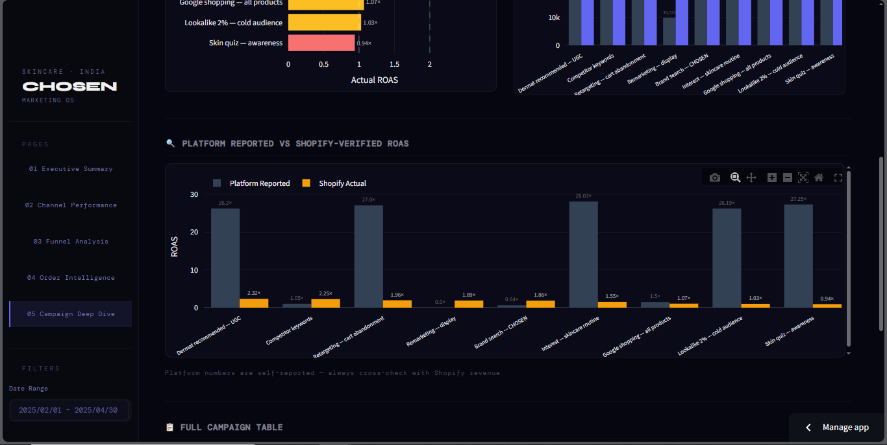

# CHOSEN — Marketing Performance Dashboard

> A production-grade marketing analytics dashboard built for a D2C skincare brand.  
> Cross-references Google Ads, Meta Ads, and Shopify data to surface ground-truth ROAS and funnel insights.

---

## The Core Insight

```
                  Platform Reported    Shopify Actual
Google Ads              0.82×              5.15×
Meta Ads               27.10×              3.92×
```

Meta overclaims ROAS by ~6.9×. Google underclaims by ~6.3×.  
Every ROAS figure in this dashboard is verified against Shopify order revenue —  
not taken from the ad platform at face value.

---

## Screenshots





---

## Overview

Most D2C brands rely on platform-reported ROAS — which is almost always wrong. This dashboard solves that by joining ad spend data directly against Shopify orders using UTM attribution, exposing the gap between what platforms claim and what actually converted.

**Built as an interview task for CHOSEN Skincare.**

---

## Tech Stack

```
Python 3.11        Data processing + app logic
SQLite             Lightweight analytical database
Streamlit 1.58     Dashboard framework
Plotly             Interactive charts
Pandas             Data wrangling
```

---

## File Structure

```
C:\Chosen-Marketing-Dashboard\
│
├── app.py                          # Main dashboard — all 5 pages + sidebar
├── load_data.py                    # Data ingestion, cleaning, SQLite loader
├── utm_normalizer.py               # UTM normalization fix
│
├── marketing_dashboard.db          # SQLite database (1,056 KB) — 4 tables
│
├── data\
│   ├── google_ads.csv              # Raw Google Ads export (27 KB)
│   ├── meta_ads.csv                # Raw Meta Ads export (38 KB)
│   ├── shopify_orders.csv          # Raw Shopify orders (35 KB)
│   └── shopify_sessions.csv        # Raw Shopify sessions (887 KB)
│
├── queries\
│   ├── page1_q_all.py              # Executive Summary queries
│   ├── page1_q1.py … page1_q4.py  # Page 1 individual queries
│   ├── page2_q1.py … page2_q5.py  # Page 2 individual queries
│   ├── page3_q1.py … page3_q5.py  # Page 3 individual queries
│   ├── page4_q1.py … page4_q6.py  # Page 4 individual queries
│   └── page5_q1.py … page5_q4.py  # Page 5 individual queries
│
├── tests\
│   ├── test_date_formats.py        # Validates date formats across all 4 tables
│   ├── test_utm_sources.py         # Validates utm_source values in orders + sessions
│   ├── test_campaign_names.py      # Validates campaign names across all tables
│   └── test_null_counts.py         # Checks null counts across all tables
│
├── requirements.txt
├── README.md
└── venv\
```

---

## Database Schema

4 tables in `marketing_dashboard.db`:

| Table | Rows | Key Columns |
|-------|------|-------------|
| `google_ads` | 453 | date, campaign_name, campaign_type, spend, clicks, ctr, cpc, conversions, roas |
| `meta_ads` | 357 | date, campaign_name, creative_format, spend, clicks, purchases, purchase_revenue, roas |
| `shopify_sessions` | 17,579 | session_date, device, utm_source, utm_campaign, added_to_cart, reached_checkout, purchased |
| `shopify_orders` | 564 | order_id, date, revenue, product, city, device, utm_source, utm_campaign |

---

## Dashboard Pages

### `01` Executive Summary
High-level business health at a glance.
- **KPIs:** Total Revenue · Total Spend · Blended ROAS · Orders · AOV · Overall CVR
- Daily Revenue vs Spend line chart
- Revenue by Source donut chart
- Revenue by Device bar chart
- Attribution data quality panel

### `02` Channel Performance
Google Ads vs Meta Ads, side by side.
- Platform KPI cards for both channels
- **Platform ROAS vs Shopify-Verified ROAS** — the core attribution insight
- Daily spend by channel (stacked bar)
- Campaign performance table with color-coded ROAS

### `03` Funnel Analysis
Where are users dropping off?
- Sessions → Cart → Checkout → Purchased funnel
- Drop-off rate progress bars at each stage
- Conversion rates by channel and by device
- Top campaigns ranked by purchase rate

### `04` Order Intelligence
Revenue breakdown across every dimension.
- Revenue by product and by city (Top 10)
- Orders and revenue over time (dual-axis)
- AOV by UTM source
- Revenue split by device

### `05` Campaign Deep Dive
Campaign-level P&L with attribution truth.
- Top performer and worst performer highlight cards
- Actual ROAS by campaign (green ≥ 2× · amber ≥ 1× · red < 1×)
- Spend vs Revenue by campaign
- Platform reported vs Shopify-verified ROAS — split by Google and Meta
- Full sortable campaign table

---

## Sidebar Filters

All 5 pages respond dynamically to 4 global filters:

| Filter | Options |
|--------|---------|
| Date Range | Feb 2025 – Apr 2025 |
| Channel | google · meta · organic · direct |
| Device | mobile · desktop · tablet |
| Campaign | Individual campaign multi-select |

---

## Data Cleaning

- Date formats standardized across all 4 tables to `YYYY-MM-DD`
- UTM nulls filled with `'unattributed'` to prevent broken SQL `IN` filters
- `utm_source` in Shopify orders normalized to match ad platform join keys
- Sessions `utm_source` aligned with orders for accurate funnel-to-conversion joins
- Null counts and campaign name consistency validated via `tests/`

---

## Running Data Validation Tests

```bash
python tests/test_date_formats.py     # Date format check across all tables
python tests/test_utm_sources.py      # utm_source values in orders + sessions
python tests/test_campaign_names.py   # Campaign name consistency
python tests/test_null_counts.py      # Null counts across all tables
```

---

## How to Run

```bash
# 1. Navigate to project folder
cd C:\Chosen-Marketing-Dashboard

# 2. Activate virtual environment
venv\Scripts\activate

# 3. Install dependencies (first time only)
pip install -r requirements.txt

# 4. Load data into SQLite (first time only)
python load_data.py

# 5. Launch dashboard
python -m streamlit run app.py
```

Opens at → `http://localhost:8501`

---

## Project Phases

| Phase | Status | Description |
|-------|--------|-------------|
| 1 | ✅ | QLite DB created with 4 tables |
| 2 | ✅ | Data cleaned — dates, UTMs, nulls |
| 3 | ✅ | 5-page dashboard structure planned |
| 4 | ✅ | 25 SQL queries written and verified |
| 5 | ✅ | Streamlit + Plotly installed |
| 6 | ✅ | All 5 pages built and styled |
| 7 | ✅ | Deployed to Streamlit Cloud — [Live Demo](https://chosen-marketing-dashboard-ohwhdynjwhv7ebyixgq8ow.streamlit.app/) |

---

## Author

**Pradeep** · Data Analyst  
📍 Hisar, Haryana &nbsp;|&nbsp; 🔗 [GitHub](https://github.com/pradeep32201-creator) &nbsp;|&nbsp; 💼 [LinkedIn](https://www.linkedin.com/in/pradeep-2350953a8/)

